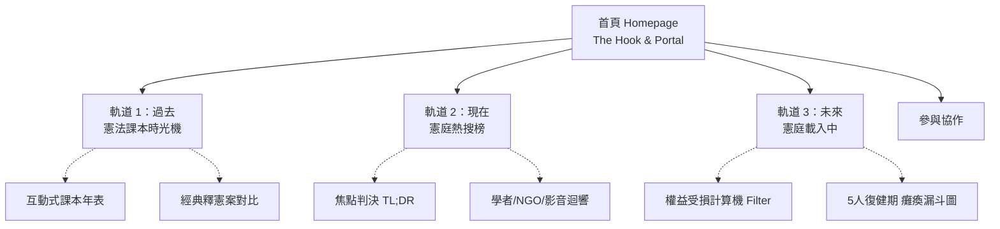

# 2. 資訊架構與核心軌道 (Information Architecture)

全站採取「過去」、「現在」、「未來」的時間軸邏輯，將冰冷的憲法法庭拆解為三條不同的沉浸式體驗軌道 (Tracks)。

## 🗺️ 全站資訊架構圖 (IA Map)

## 🛠️ 三大核心軌道 (Core Tracks) 開發細節

### 📖 軌道一：過去 - 憲法課本時光機 (On This Day)
*   **定位**：喚醒共鳴，對齊「如果沒有憲法法庭，我們就沒有這些權利」的歷史共識。
*   **互動模式**：Scroll-telling (滾動式敘事)。
*   **介面佈局**：高保真度的 Split-Screen (左右分屏) 佈局，強烈對比。
    *   **左側 (The Theory)**：高中《公民與社會》教科書的懷舊視覺，解釋法條。
    *   **右側 (The Reality)**：全螢幕的高對比歷史現場照片與衝擊文案（現代感）。

### 📰 軌道二：現在 - 憲庭熱搜榜 (Trending Now)
*   **定位**：提供倡議青年的「彈藥庫」，防範資訊焦慮的去中心化一站式集散地。
*   **互動模式**：清晰的分類閱讀、快速篩選。
*   **介面佈局**：採用 **期刊跨頁 (Magazine Spread)** 結構。
    *   **左半部（官方定調）**：固定的 焦點判決 `TL;DR`。
    *   **右半部（民間迴響）**：結構化區分「學者專欄」、「NGO 報告」與「短影音」，並採用帶有 macOS 視窗控制點的「數位引流報頭 (Masthead)」設計，強調客觀的新聞聚合感。

### ⏳ 軌道三：未來 - 憲庭載入中 (C0urt is Loading…)
*   **定位**：將法庭癱瘓的抽象危機，化為「打中你我的具體權益受損」。
*   **互動模式**：互動過濾器與資料視覺化。
*   **介面佈局**：冷靜、精密的「系統瓶頸檢測」視圖。
    *   **1. 權益計算機 (Filter)**：點選身分 (如：勞工、女性)，即時篩選卡關案件。
    *   **2. 瓶頸漏斗視覺化 (The Bottleneck)**：Sankey/Flow Diagram 呈現大量案件小點，僅能緩慢通過只剩「5 位大法官 (5 Active Justices)」的過濾器，反映復健期的運能極限。
