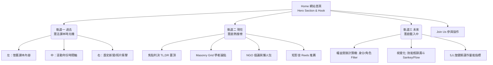

# 【Add C0urt 憲庭加好友】全站資訊架構與建置計畫 (IA & Implementation Plan)

本企劃書彙整了「Add C0urt 憲庭加好友：別讓你的權利已讀不回」專案的三大核心資訊架構。此文件旨在作為 g0v 專案協作中心（前端工程師、UI/UX 設計師、文案編輯及開源志工）的最高指導藍圖。

## 🎯 網站核心策略與定位 (Strategic Positioning)

*   **專案目標**：將「過去課本裡的民主成就」數位化，轉化為「被卡住的現實危機」，降低公民理解憲法法庭價值的門檻。
*   **目標受眾**：關心社會但對複雜法律感到焦慮的年輕世代（高中、大學生、首投族）。
*   **設計體驗方針**：從「過去的強烈情感與記憶」，過渡到「現在的理性結構與去焦慮」，最終抵達「未來的中性、精準但緊迫的系統瓶頸」。

---

## 🗺️ 全站資訊架構圖 (Information Architecture Map)

---

## 🛠️ 三大核心軌道 (Core Tracks) 實作細節

### 📖 軌道一：過去 - 憲法課本時光機 (On This Day)
*   **IA 目標**：透過個人記憶連結公共歷史，建立「如果沒有憲法法庭，我們就沒有這些權利」的共識。
*   **介面佈局**：高保真度的 Split-Screen (左右分屏) 佈局，強調對比。
*   **互動模式**：Scroll-telling (滾動式敘事)。
    *   **左側 (The Theory)**：仿高中《公民與社會》教科書的泛黃視覺與排版，搭配螢光筆與手寫筆記。
    *   **右側 (The Reality)**：全螢幕的黑白/高對比歷史運動與新聞現場照片，搭配現代感粗體文案（例如：「你不再因為思想不同而被判定為叛亂罪」）。
*   **開發準備資源**：[Scroll-telling HTML/CSS Prototype 框架](file:///Users/ipa/.gemini/antigravity/playground/pyro-eclipse/add-c0urt-prototype.zip)。志工可以直接套件並填寫內容。

### 📰 軌道二：現在 - 憲庭熱搜榜 (Trending Now)
*   **IA 目標**：防範資訊焦慮，成為一個乾淨、結構化、零門檻的一站式去中心化資訊集散地。
*   **介面佈局**：Dashboard 儀表板與 Masonry Grid (瀑布流) 策展風格。
*   **互動模式**：快速瀏覽與篩選。
    *   **置頂焦點 (Headline)**：近期重大判決（如：114年憲判字第1號）的 `TL;DR` 摘要，以條列式 Point 解構複雜法律。
    *   **矩陣分類 (Perspective Grid)**：將討論拆解為「學者文章 (Scholar Articles)」、「NGO 報告 (NGO Reports)」與「短影音 (Reels)」，協助讀者跳脫同溫層。
*   **視覺語彙**：淺灰/淺藍等中性冷靜色調，強調清晰易讀的版面配置 (Typography-driven)。

### ⏳ 軌道三：未來 - 憲庭載入中 (C0urt is Loading…)
*   **IA 目標**：精準呈現當下不是癱瘓，而是僅有「5 人復健期」的系統效能極限，並提醒民眾身分的直接關聯。
*   **介面佈局**：冷靜、精密的「系統效能檢測」科技感視圖。
*   **互動模式**：
    *   **1. 權益計算機 (Filter Bar)**：直覺化搜尋列，使用者輸入或點擊自己的身分（如：勞工、女性、學生），即時連動下方的數據圖呈現相關卡關案件。
    *   **2. 瓶頸/漏斗視覺化 (The Bottleneck Metaphor)**：不使用錯誤或閃爍紅光，而是用一個漏斗圖 (Sankey Diagram)，左側有千百顆代表「待審案件」的小圓點互相推擠，卻只能緩慢通過中間**僅有 5 個通道 (5 Active Justices)** 的咽喉區段。
*   **資料需求**：強烈依賴爬蟲資料 (JSON)，需由志工將案件梳理出 `Tag` (標籤) 與 `Wait Time` (等待週期)。

---

## 🚀 技術堆疊建議 (Tech Stack Recommendation)

與原本企劃相符，為了降低營運與維護成本，並方便公民黑客協作：

*   **前端框架**：`React.js` (推薦 `Next.js`) 或 `Vue.js` (`Nuxt.js`) 生成靜態網站 (Static Site Generation, SSG)。
*   **CSS 樣式**：`Tailwind CSS` (快速建立 Dashboard 格線與組件)。
*   **資料視覺化與動畫**：
    *   *(過去)* 滾動敘事：前端框架本身的 Scroll Hook + CSS Transitions。
    *   *(未來)* 瓶頸漏斗圖：`D3.js` 或利用 `@react-spring` 進行座標模擬動畫。
*   **資料來源**：放置於 GitHub Repo 中的靜態 JSON 檔案 (Data-driven pattern)，由 Python 腳本定期更新司法院資料並透過 CI/CD 刷新網站內容。

## 📝 志工交接 (Handoff Requirements)

1.  **UI/UX 設計師**：可依據本文件與 wireframe，在 Figma 中建立完整的 Design System 與三個軌道的 Mockup。色彩請從復古黃(過去) -> 冷靜灰(現在) -> 科技藍/微橘(未來系統警示)。
2.  **前端工程師**：可以直接使用 `/Users/ipa/.gemini/antigravity/playground/pyro-eclipse/add-c0urt-prototype.zip` 測試「過去」的滾動互動。
3.  **文案/法律志工**：請集中火力在產出「現在」的 TL;DR 白話文與「未來」案件的 Tagging 標籤整理。
