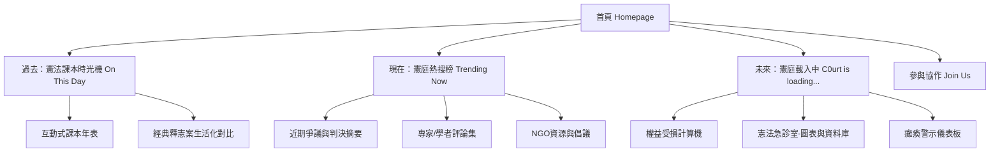

Read URL: https://docs.google.com/document/d/1JcBxsGY7ygGGCXAEdWkt-2EGqQyvYBybAwLd0RFJJPQ/export?format=txt

身為資訊架構師（Information Architect），在仔細閱讀了您提供的《Add C0urt 憲庭加好友》企劃書後，我為這個面向「具備公民意識年輕世代」的網站，規劃了以下高階層次的**資訊架構 (Information Architecture, IA)** 與**網站建置計畫**。

這個計畫的核心目標是：**「降低理解門檻，將『課本裡的民主成就』數位化，並將『被卡住的現實危機』具象化。」**

---

### 🌐 1. 網站總體策略與受眾定位 (Strategic Foundation)

*   **網站名稱**：Add C0urt 憲庭加好友：別讓你的權利已讀不回
*   **目標受眾 (TA)**：高中生、大學生、首投族、關心社會議題但對複雜法律無感的年輕世代。
*   **核心痛點**：憲法法庭議題太遙遠、太生硬。
*   **解方策略**：透過「個人記憶（高中公民課本）」連結「公共歷史」，再將現況的「法庭癱瘓」與個人的「日常權益」綁定。

---

### 🗺️ 2. 網站資訊架構 (Information Architecture)

為呈現「過去、現在、未來」的時間軸概念，網站架構分為三大核心模組 (Tracks) 與輔助頁面：

#### 📍 首頁 (Homepage - The Hook)
*   **Hero Section (首屏視覺)**：強烈的情感訴求（例：「攻擊憲法法庭，就是民主消亡的開始」），強調憲庭與日常生活的關聯。
*   **價值主張 (Value Proposition)**：精簡解釋網站目的（為什麼我們在這裡？）。
*   **導覽入口 (Navigation)**：清晰的情境式入口，引導使用者進入「過去」、「現在」、「未來」三個不同的沉浸體驗區塊。

#### 📖 軌道一：過去 - 憲法課本時光機 (On This Day)
*   **設計體驗**：運用 **Scroll-telling (滾動式敘事)** 搭配懷舊課本風格 (Nostalgic UI)。
*   **核心功能**：互動式課本年表。
    *   **左側畫面**：高中《公民與社會》相關章節課本截圖（如「保障言論自由」）。
    *   **右側畫面**：真實世界照片與判決影響（如「太陽花學運」、「同婚釋字第748號」、「集遊法釋字第445號」）。
*   **目標**：喚醒共鳴，對齊「憲法法庭曾經為我們做了什麼」的共識。

#### 📰 軌道二：現在 - 憲庭熱搜榜 (Trending Now)
*   **設計體驗**：清晰的資訊儀表板或策展式版面，降低資訊焦慮。
*   **核心功能**：一站式去中心化資訊集散地。
    *   **焦點議題**：例如 114年憲判字第1號判決的白話文摘要。
    *   **多元觀點**：分類彙整學者觀點（如張娟芬、黃丞儀、蘇彥圖等）以及 NGO 組織（法白、司改會）的多媒體素材（短影音、文章）。
*   **目標**：提供結構化的懶人包，防範假訊息，讓閱聽者在網海中不迷失。

#### ⏳ 軌道三：未來 - 憲庭載入中 (C0urt is Loading…)
*   **設計體驗**：紅色、故障風 (Glitch) 或警示風格，營造「權利卡關」的危機感。
*   **核心功能**：
    *   **權益受損計算機 (Personalized Filter)**：使用者點選/輸入自己的身分（例如：女性、勞工、學生）。系統即時篩選並列出目前被卡在法庭、與該身分相關的釋憲案。
    *   **癱瘓警示儀表板**：數據視覺化呈現。用紅點大小或變黑的程度，具象化每個案件「等待天數」的急迫性。
    *   **憲法急診室**：簡易搜尋引擎（ElasticSearch/Filter）查詢法庭候審案件。
*   **目標**：將抽象的法庭癱瘓，轉化為具體的「與我有關的危機」。

---

### 💻 3. UI/UX 設計與技術評估 (Tech & Design Specs)

為了確保志工能快速協作、維護成本低且能乘載高流量，建議採用以下技術堆疊：

*   **前端架構 (Frontend)**
    *   使用框架：**React.js (Next.js)** 或 **Vue.js (Nuxt)** 生成靜態網站 (SSG)，結合 **Tailwind CSS** 快速構建響應式設計。
    *   互動特效：使用如 `Framer Motion` 或 `GSAP` 實現 Scroll-telling (課本時光機) 和資料視覺化動畫。
*   **後端與資料庫 (Backend & Data)**
    *   **無伺服器架構**：為了降低營運成本，盡量不寫複雜的 Backend。
    *   資料來源：透過定期的 Python 爬蟲抓取司法院資料庫，並經由 GitHub Actions 將資料轉為 JSON，直接餵給前端 (Data-driven Static Site)。
    *   「憲庭載入中」的搜尋可使用輕量級的 Fuse.js (前端搜尋) 或簡易 API。
*   **部署與代管 (Hosting)**
    *   依賴 GitHub Pages 或 Vercel 免費部署，確保擁有不變的「永久網址」。
*   **協作與開源 (Open Source)**
    *   所有程式碼、設計文檔 (Figma) 開源，建立清晰的 `CONTRIBUTING.md`（對應文件中的 Issue Pool 任務池），方便 G0v 社群的公民黑客協作。

---

### 🚀 4. 下一步推動計畫 (Next Steps)

1.  **MVP (最小可行性產品) 開發階段**：
    *   **優先生產「過去：憲法課本時光機」**：這部分素材（課本照片、歷史照片）最容易取得，且能快速引發社群轉發與共鳴，是網站上線初期的最大亮點。
2.  **資料梳理階段 (Tagging & OCR)**：
    *   啟動「公民/文案人」志工，針對【憲庭載入中】的釋憲案撰寫「白話文案由」，並貼上「生活化標籤」（勞工、性別、婚姻等），以利下一步開發「權益受損計算機」。
3.  **UI 視覺定調**：
    *   確定全站的色彩計畫。需要無縫融合「懷舊復古（課本）」、「現代簡約（資訊整合）」與「故障危險（警示區）」三種調性。

這份架構確保了網站不只是一個被動的文章倉庫，而是一個**「以人為本、從個人經驗出發並走向公共行動」**的數位互動空間。請問您對這樣的資訊架構方向有什麼想法？如果是要實際進入開發，我們可以先從哪個模組（過去/現在/未來）開始繪製 Wireframe？